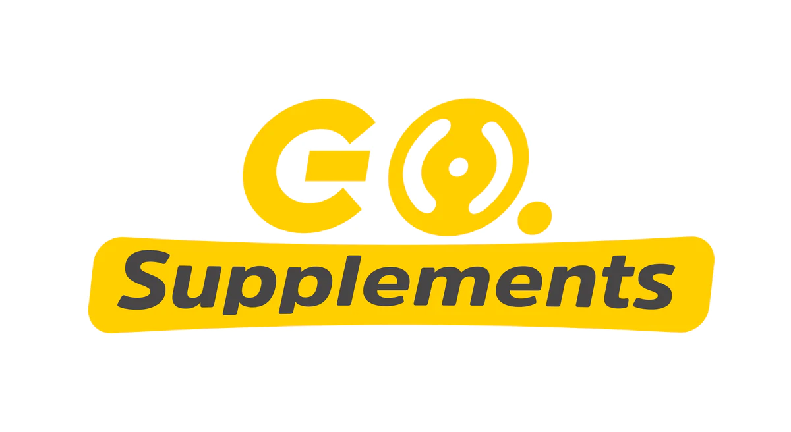

# **GO SUPPLEMENTS ARGENTINA.**
## Venta de suplementos deportivos para atletas de alto rendimiento.
### Logra tu máximo rendimiento. Desbloquea tu potencial y alcanza tu bestia interior con los mejores suplementos de Europa. Creado por y para los deportistas.

## HISTORIA
Comprendimos la necesidad imperiosa de gozar de importaciones de calidad en el país. 
Somos conscientes de que mejorar tu rendimiento puede ser un camino cuesta arriba sin las herramientas necesarias. Por eso, de la mano de GO Supplements USA traemos al mercado nacional:

- Proteinas Whey 
- Creatina Monohidratada
- Rodilleras, muñequeras, scraps.

## Publico Objetivo
Deportistas casuales, recurrentes. 18 a 35 años.

> Fuente principal: Roboto
> Fuente alternativa: Open Sans

## Paleta de colores:
`#3f0786 - Morado oscuro`
`#8c8dc8 - Lima clarito`
`#4e7785 - Turquesa claro`
`#00525c - Turquesa oscuro`
`#b960f6 - Rosa clarito`

## Logo: 
